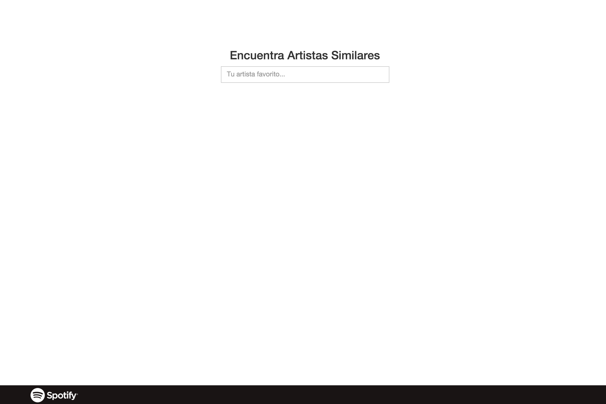

# Clase 14


**4 -** Utilizando la [API del NYTimes](http://developer.nytimes.com/docs) vamos a crear una web que nos muestre los libros más vendidos de la [categoria Hardcover Fiction](http://www.nytimes.com/best-sellers-books/2016-01-17/hardcover-fiction/list.html)
**Especificaciones:**
- [Consigue tus credenciales dandote de alta](https://myaccount.nytimes.com/auth/login?URI=http:/developer.nytimes.com/login/external)
- Debes incluir una animación mientras esperamos la carga del contenido.
- Los libros deben estar organizados según el orden de la lista oficial
- Debes incluir la carátula del libro
- Debes incluir la cantidad de semanas que lleva en la lista
- Debes incluir la descripción
- Debes incluir el titulo y la posición que ocupa en la lista ( #1 titulo.... #2 titulo....)
- Debes incluir el link para poder comprar el libro en amazon (debe abrirse en otra pestaña)

**Trucos:**
- Mira en detalle la [documentación oficial](http://developer.nytimes.com/docs)
- Usa el *[Books API](http://developer.nytimes.com/docs/books_api/)*

```javascript
	// Tu solución
```

**Concepto:**


**5 -** Refactorizaremos el ejercicio anterior para ofrecer al cliente un dashboard con la listas disponibles en *[Books API](http://developer.nytimes.com/docs/books_api/)*.
**Especificaciones:**
- Debes incluir una animación mientras esperamos la carga del contenido.
- Al cargar la web deben de aparecer todas las listas con los siguientes datos:
	- Nombre completo de la lista
	- La fecha del libro más antiguo en la lista
	- La fecha del libro ultimo incorporado
	- La frecuencia de actualización
	- Un link para poder cargar la lista.
- Al pinchar en el link de una lista especifica el DOM debe cambiar e incluir los siguientes datos:
- Un bontón para *volver atras* y recargar la disposición anterior
- Los libros deben estar organizados según el orden de la lista oficial
- Debes incluir la carátula del libro
- Debes incluir la cantidad de semanas que lleva en la lista
- Debes incluir la descripción
- Debes incluir el titulo y la posición que ocupa en la lista ( #1 titulo.... #2 titulo....)
- Debes incluir el link para poder comprar el libro en amazon (debe abrirse en otra pestaña)

```javascript
	// Tu solución
```
**Concepto:**
- Portada:


- Dentro de una lista:


**6 -** Usando el [API de Spotify](https://developer.spotify.com/web-api/) crearemos una aplicación que nos permita buscar artistas similares a un artista que el usuario introduzca.
**Especificaciones:**
- Debes incluir una animación mientras esperamos la carga del contenido.
- Debes tener en cuenta todos los posibles errores (no existe el artista, no conecta con el api, etc...) para informar al usuario.
- En la respuesta debes incluir:
	- Un número finito de artistas similares
	- El nombre del artista
	- Una imagen del artista
	- El número de seguidores
	- Su popularidad


**Trucos:**
- Consulta todos los detalles sobre las rutas de la API en este [enlace](https://developer.spotify.com/web-api/endpoint-reference/)
- Estudia el flujo de la información:
	- Es necesario buscar al artista por nombre usando *[/search/](https://developer.spotify.com/web-api/search-item/)*
	- Para posteriormente buscar artistas similares usando el ID del artista escogido usando *[/artist/](https://developer.spotify.com/web-api/artist-endpoints/)*

```javascript
	// Tu solución
```

**Concepto:**

- Buscador:



- Resultado:


### Proyectos Personales

Es hora de poner en práctica todo lo aprendido con un proyecto personal.

- **Funcionamiento:**
	- Usaremos los [issues de nuestro repositorio](https://github.com/UlisesGascon/curso-js-web-developers-012016/issues) para coordinar todas las dudas que tengais.
	- Crearemos un nuevo repositorio en Github para desarrollar el proyecto.
- **Entrega:**
	- 17 Mayo, 19:00 